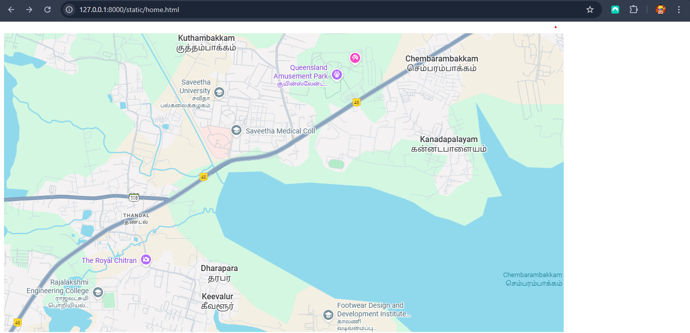
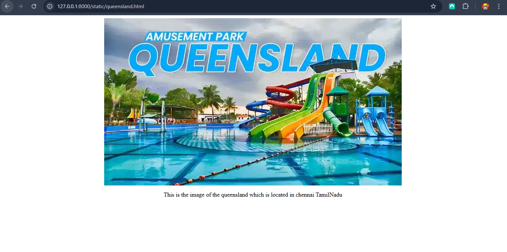
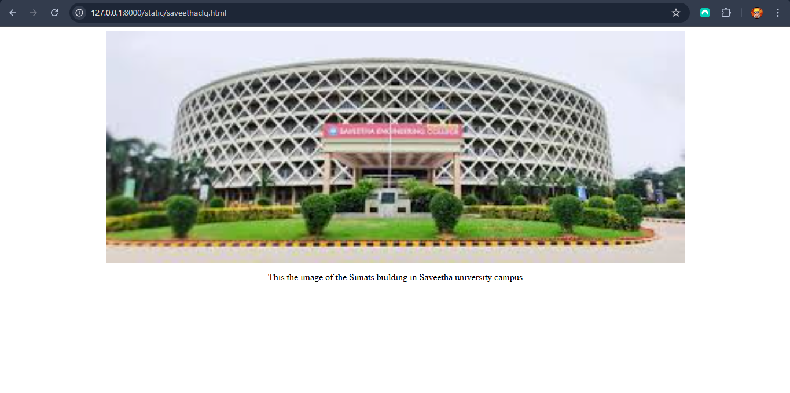
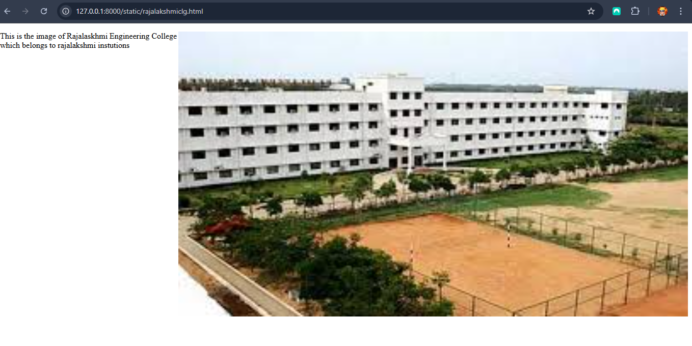

# Ex04 Places Around Me
## Date: 27/09/2025

## AIM
To develop a website to display details about the places around my house.

## DESIGN STEPS

### STEP 1
Create a Django admin interface.

### STEP 2
Download your city map from Google.

### STEP 3
Using ```<map>``` tag name the map.

### STEP 4
Create clickable regions in the image using ```<area>``` tag.

### STEP 5
Write HTML programs for all the regions identified.

### STEP 6
Execute the programs and publish them.

## CODE
```
home.html
<!DOCTYPE html>
<html lang="en">
<head>
    <meta charset="UTF-8">
    <meta name="viewport" content="width=device-width, initial-scale=1.0">
    <title>Document</title>
</head>
<body>


<map name="image-map">
    <area target="" alt="Thandalam" title="Thandalam" href="rajalakshmiclg.html" coords="263,479,37,598" shape="rect">
    <area target="" alt="chettipedu" title="chettipedu" href="saveethaclg.html" coords="461,277,423,262,395,238,376,208,312,181,306,141,319,114,354,95,372,89,401,57,434,55,469,49,505,62,536,72,544,93,546,122,557,146,567,191,572,210,574,229,526,262,492,271" shape="poly">
    <area target="" alt="chennai" title="chennai" href="queensland.html" coords="678,118,118" shape="circle">
</map>
</body>
</html>


queensland.html
<!DOCTYPE html>
<html lang="en">
<head>
    <meta charset="UTF-8">
    <meta name="viewport" content="width=device-width, initial-scale=1.0">
    <title>Document</title>
    <style>
img {
  display: block;
  margin: auto;
}
</style>
</head>
<body>
    
    <p  align="center">This is the image of the queensland which is located in chennai TamilNadu</p>
</body>
</html>

rajalakshmiclg.html
<!DOCTYPE html>
<html lang="en">
<head>
    <meta charset="UTF-8">
    <meta name="viewport" content="width=device-width, initial-scale=1.0">
    <title>Document</title>
    <style>
img {
  display: block;
  margin: auto;
  float: right;
}
</style>
</head>
<body>
    
    <p>This is the image of Rajalaskhmi Engineering College which belongs to rajalakshmi instutions</p>
</body>
</html>


saveethaclg.html
<!DOCTYPE html>
<html lang="en">
<head>
    <meta charset="UTF-8">
    <meta name="viewport" content="width=device-width, initial-scale=1.0">
    <title>Document</title>
    <style>
img {
  display: block;
  margin: auto;
}
</style>
</head>
<body>
    
    <p align="center">This the image of the Simats building in Saveetha university campus</p>
</body>
</html>
```

## OUTPUT










## RESULT
The program for implementing image maps using HTML is executed successfully.
